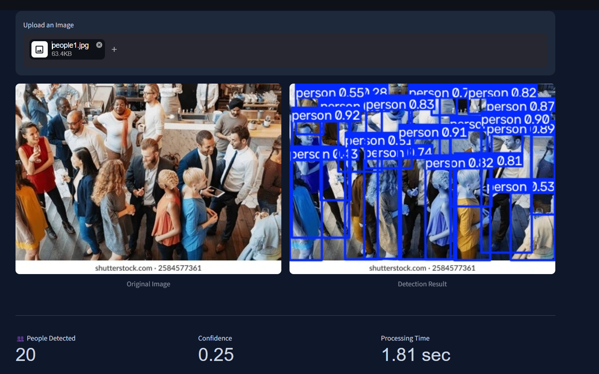

# AI CCTV People Counting & Detection System

## Overview

AI CCTV People Counting & Detection System is a computer vision application developed using Python, YOLOv8, and Streamlit for detecting and counting people from images, uploaded videos, and live webcam input.

## Problem Statement

Manual CCTV monitoring requires continuous observation and makes people counting difficult when processing large amounts of visual data.

This project uses AI-based object detection to automatically detect and count people from different visual inputs.

## Objective

- Detect people from images, videos, and webcam streams
- Automatically count detected people
- Provide visual detection results
- Support configurable detection settings
- Generate processed video results
- Provide an interactive Streamlit interface

## Key Features

- YOLOv8-based person detection
- People counting
- Image detection
- Video detection
- Live webcam detection
- Configurable confidence threshold
- Configurable image size for image detection
- Bounding-box visualization
- Processing-time measurement
- Maximum people count during video processing
- Live people count during webcam detection
- Downloadable image results
- Downloadable processed videos
- CUDA GPU acceleration when available
- CPU fallback when CUDA is unavailable

## Technology Stack

| Technology | Purpose |
|---|---|
| Python | Application development |
| YOLOv8 | Person detection |
| Ultralytics | YOLO model implementation |
| PyTorch | Model inference and GPU acceleration |
| OpenCV | Image and video processing |
| Streamlit | Web application interface |
| NumPy | Image processing |
| Pillow | Image handling |
| FFmpeg | Video conversion |

## System Architecture

```text
Input Sources
     |
     +----------+----------+
     |          |          |
   Image      Video      Webcam
     |          |          |
     +----------+----------+
                |
                v
         Input Processing
                |
                v
           YOLOv8x Model
                |
                v
         Person Detection
                |
                v
          People Counting
                |
                v
       Result Visualization
                |
                v
        Streamlit Interface
```

## Model Used

The project uses the YOLOv8x object detection model from Ultralytics.

The model is configured to detect the person class and is used for image, video, and webcam detection.

### Model Configuration

- Model: YOLOv8x
- Detection class: Person
- Confidence threshold: Configurable
- IoU threshold: 0.45
- Image detection resolution: Configurable
- GPU acceleration: CUDA supported when available
- CPU fallback: Supported when CUDA is unavailable

The application expects the `yolov8x.pt` model file in the project root directory. The model is not included in the repository because of its large file size.

## Methodology

1. Input is provided through an image upload, video upload, or webcam.
2. The input is processed using OpenCV and image-processing libraries.
3. YOLOv8x performs object detection.
4. The person class is selected for detection.
5. Detected bounding boxes are obtained from the model output.
6. The number of detected people is calculated.
7. Detection results are displayed with bounding boxes.
8. Image results can be saved and downloaded.
9. Video frames are processed sequentially to generate an annotated video.
10. Webcam frames are processed continuously to display the current people count.

## Project Structure

```text
AI_CCTV_People_Counting/
|
+-- assets/
+-- components/
+-- models/
+-- styles/
+-- utils/
+-- views/
|
+-- app.py
+-- requirements.txt
+-- .gitignore
+-- README.md
```

## Installation

### 1. Clone the Repository

```bash
git clone https://github.com/ElakiyaRamajayam/AI_CCTV_People_Counting.git
cd AI_CCTV_People_Counting
```

### 2. Create a Virtual Environment

```bash
python -m venv venv
```

### 3. Activate the Virtual Environment

Windows:

```bash
venv\Scripts\activate
```

### 4. Install Dependencies

```bash
pip install -r requirements.txt
```

### 5. Add the YOLOv8x Model

Place the required model file in the project root:

```text
yolov8x.pt
```

The model file is not included in the repository because of its large size.

### 6. Install FFmpeg

FFmpeg is required for video processing and conversion.

Make sure `ffmpeg` is available through the system PATH.

## Running the Application

Start the application using:

```bash
streamlit run app.py
```

The application provides the following sections:

- Dashboard
- Image Detection
- Video Detection
- Live Camera
- Reports
- Settings

The Reports section is currently under development.

## Results

The system provides:

- People count for uploaded images
- Annotated image detection results
- Current people count from webcam input
- Maximum people count during video processing
- Annotated processed video output
- Detection confidence information
- Processing time information

## Challenges

- Efficient processing of video frames
- Maintaining performance during live webcam detection
- Managing GPU and CPU inference
- Supporting multiple video formats
- Converting processed videos into browser-compatible formats
- Managing large YOLO model files

## Future Enhancements

- Improve detection performance
- Enhance dashboard statistics
- Complete the reports module
- Improve result visualization
- Add advanced detection analytics
- Optimize video and webcam processing

## Demo / Screenshots

Screenshots of the application and detection results can be added here.

### Dashboard

![Dashboard].(assets/Dashboard.png)

### Image Detection



### Video Detection

Add video detection screenshot here.

## Author

**Elakiya R**

AI and Computer Vision Project
